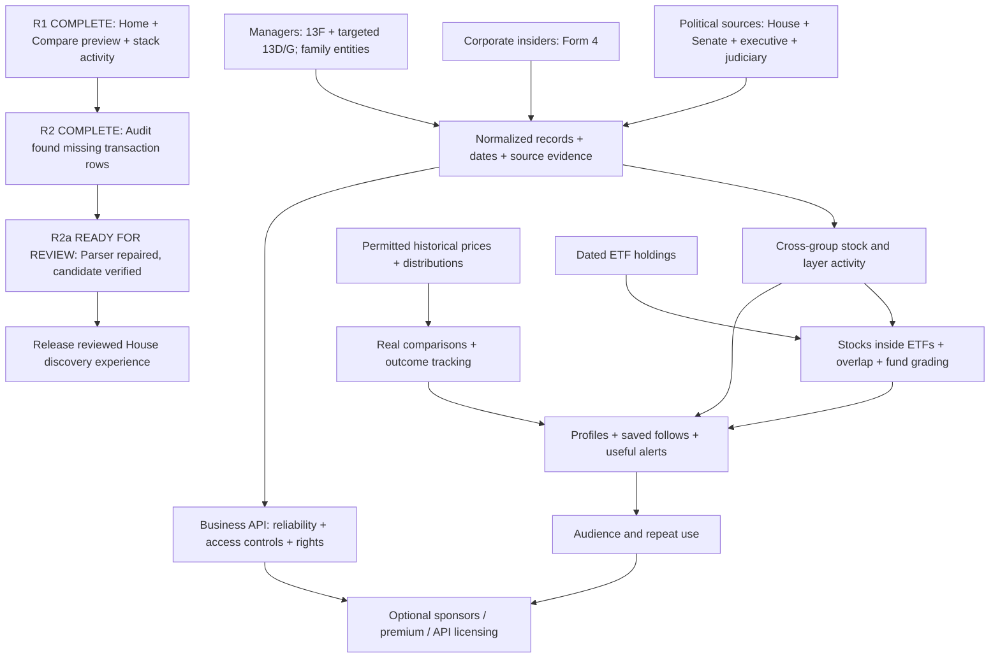

# Outfox build roadmap and execution ledger

Updated September 8, 2026. Owner: Codex; product decisions: Joe.

## The destination

**Pull back the curtain for regular people.** Show what influential public officials, investment managers, and corporate insiders disclosed; identify overlap and disagreement; explain what happened afterward; connect stocks to understandable fund comparisons. Build a reusable evidence system that businesses may eventually want to license. Do not promise investment success or API demand before it is demonstrated.

Keep the approved headline: **Trade smarter than the people in charge.** Outfox is larger than the AI/data-center story. Home leads with discovery; Explore houses the stack; Compare gets its own destination when real data is ready. Learning supports the experience rather than leading the build queue. No FSELX examples. Compare's placeholder is now `Try AAPL, Microsoft, or your own ticker`.

This document supersedes the build ordering and conflicting messaging in the older brand and informed-money planning documents. Older technical specifications remain reference material, not automatic approval of their scoring formulas, licensing assumptions, or historical estimates.

## Status snapshot - evidence, not promises

**September 8 recovery update:** R1 is ready for review. R2's bounded audit is complete, and its resulting parser repair (R2a) is now verified locally. The candidate contains 2,516 transactions, recovering 1,519 while retaining all 997 existing IDs and raw evidence. Independent PDF extraction matched all 2,516 economic-field rows across 375 cached documents. Final tests: 506 passed, 2 existing skips, no failures; lint, TypeScript, production/preview builds and isolation checks passed. See `r2a-house-recovery-2026-09-08.md`. Nothing was published. Review and a supervised import remain; scanned reports and newer uncollected filings are separate coverage gaps.

| Area | Actual state | Evidence / remaining limit |
|---|---|---|
| Existing public site | Last reported deployed | House archive, stack, quotes, reference pages. Last reported House refresh: September 5, 997 rows. Production was not freshly reverified for this roadmap. |
| New discovery homepage + full archive navigation | Built locally; not published | Real House records, purchase clusters, search and pagination; prior browser checks. |
| Compare | Built locally; demo only | Ticker/name entry, amount input, 2-10 selections, short-history handling. Six generated ETF histories only; other tickers can remain unavailable. Search is not a market-wide security master. |
| Explore purchase-activity card | R1 ready for review; not published | Desktop/mobile, year / 30-day windows, keyboard preview/pin, evidence expansion, and empty state verified. All layer companies considered. See R1 verification receipt. |
| Duplicate-filer fix | R1 code/tests and browser checks passed | Explicit McGuire alias, scoped by chamber/state/district; original records unchanged. R2 independently audits the source identity. |
| Theme hydration correction | Browser verified | Dark mode survives reload/navigation; no hydration errors recorded in the R1 test tab. |
| SEC Form 4 | Foundation merged; private | Parser, fixtures and manual importer exist. No public archive, public insider interface or scheduled collection. |
| Senate / executive / judicial / manager feeds | Not connected | Source-specific adapters, access review, fixtures and release gates still needed. |
| Real comparison returns / ETF-to-buy matches / trade outcomes | Not connected | Need permitted histories or holdings and validated calculations. |

R1 automated receipt: **492 tests; 490 passed, 2 existing cache-dependent tests skipped; no failures.** Both builds passed asset/render checks after the Explore-card addition. R2 adds source-preserving chronology warnings and a blocking partial-parse conservation gate: **496 tests; 494 passed, 2 skipped; zero failures**, lint and TypeScript passed. No new production deployment or paid provider purchase occurred.

## Visual dependency map

## Estimated remaining work

These are **planning ranges in focused working hours**, including implementation, tests and review for the bounded first version described. They are not elapsed calendar guarantees and are not measured task progress. Only the near-term work has enough inspected code for reasonable confidence. Source-adapter and commercial estimates are low confidence until a short discovery pass verifies access and sample records. External approvals, vendor negotiations, historical backfills at scale, ongoing operations and audience growth are excluded.

At 4 actual focused hours per weekday, 20 hours is about one workweek. At 8, it is about half a week. Owning several AI subscriptions does not mean those workers are running simultaneously. No other model has been dispatched by this roadmap. Estimates must be revised after discovery; do not add them into a promised launch date.

| ID | Bounded next deliverable | Remaining hours | Dependency / completion test |
|---|---|---:|---|
| R1 | Current preview: activity card, theme, mobile, controls, evidence and production isolation | 0 — complete | Browser proofs and tests/build passed; not published. Original estimate was 2-4 hours. |
| R2 | House data integrity / coverage audit; identity aliases, missing/scanned inventory, two date anomalies | 0 — audit complete | Findings and safeguards saved; recovery is R2a. Original estimate was 8-16 hours. Full OCR recovery is additional work. |
| R2a | Repair blank-owner row segmentation and reconcile a candidate archive | 0 — bounded repair complete | Independent 375-document check, nine source-PDF fixtures, identity/raw preservation and repeat replay passed. Ready for review, not published. |
| R3 | Market-data and holdings source decision packet | 6-12 | Confirm display, derived-calculation and eventual API rights separately; exact costs and sample coverage. No spend without Joe. |
| R4 | Real Compare for an initial supported catalog | 12-24 | R3; adjusted history, distributions, security lookup, availability handling and independent return reconciliation. Not every global ticker. |
| R5 | Initial ETF holdings ingestion + stock-to-ETF activity match | 12-24 | R2/R3; dated holdings, stock identity matching, weights and partial coverage; do not imply ETF shares were purchased. |
| R6 | Activate Form 4 as a reviewed public insider feed | 8-16 | Existing parser; supervised sample import, amendments/classifications, QA, page and failure-safe release. |
| R7 | Senate first validated collector and source lane | 16-32 | Verify access/use conditions and representative reports; source-linked tests, completeness and failure gates. |
| R8 | Manager cohort + 13F holdings changes | 20-40 | Verify legal filers/CIKs for 10-15 managers; two reporting periods plus amendments; report holdings changes, not exact trades. |
| R9 | Executive-branch first covered-official collection | 16-32 | Access inventory, requests when necessary, annual vs transaction reports, ownership and source review. Not every executive employee. |
| R10 | Judicial first covered-judge collection | 16-32 | Access/use review, sample corpus, disclosure types and redactions; completeness inventory. Not universal unseen activity. |
| R11 | Targeted 13D/13G and disclosed family-office entities | 12-24 | Identify appropriate entities and filings; ownership changes are source-specific. No claim of seeing private strategies or all assets. |
| R12 | Multi-source stock / layer convergence | 10-20 | R2/R6/R8 plus new lanes as available; distinct actors, conflicting direction, freshness and source-specific denominators. |
| R13 | Connected stock and actor profiles; site-wide evidence search | 12-24 | R2 and source records; stable URLs, drill-down histories and pagination, not isolated cards. |
| R14 | Purchase outcome tracking and benchmark comparison | 16-32 | R3/R4 + public-availability timestamps; transaction-date vs disclosure-date outcomes; not inferred personal profit. |
| R15 | Persistent watchlists, saved comparisons and useful alerts | 16-32 | Persistence/auth and feed freshness; consent, unsubscribe, deduplicated alerts and delivery verification. |
| R16 | Fund / manager scorecards and comparisons | 20-40 | R4/R5/R14; separate performance, risk, fees, concentration and overlap; published method, no sponsor influence. |
| R17 | Search / ChatGPT / Claude discoverability and contextual learning | 8-16 | Server-readable original content, sources, canonical pages, schema, crawl tests and jargon links; no ranking guarantee. |
| R18 | First repeatable newsletter / X / short-video workflow | 8-16 | Source-reviewed stories, email delivery checks, branded templates and measurement; video production may need Joe. No auto-posting. |
| R19 | Controlled business API pilot | 24-48 | Reliable records, permitted redistribution, documentation, versioning, pagination, authentication, limits, monitoring and export tests. |
| R20 | Monetization experiments and scorecard | 6-12 | Audience evidence and Joe's choice: sponsorship, later premium or API; track demand before building checkout. No guaranteed revenue. |
| R21 | Reconcile older reliability and archive-API backlog | 6-12 | Independently recheck news failure/recovery, missing versus zero prices, /briefing redirect, sort/scope filters and API pagination beyond prior limits; do not assume these are already fixed. |
| R22 | Harden shared cross-source evidence contract | 12-24 | Stable actor/security IDs, immutable revisions, public-availability timestamps, publication history, per-source distribution controls and runtime validation before cross-source/API release. |

### Milestones to discuss in plain English

1. **Showable update complete:** R1 is verified and available in the local preview. This is the House-based experience, not complete political coverage.
2. **Credible House discovery release:** R2 audit and R2a repair are complete locally. Review the repair, then perform a supervised import with regenerated run/publication metadata and production verification. The offline candidate is not a production file to copy. Scanned/newer filings remain explicit coverage gaps. Deployment requires approval.
3. **Real comparison + ETF connection:** R3-R5, roughly 30-60 focused hours after starting that work; external access/rights wait is additional and currently unknown.
4. **Three-group overlap:** R6/R8/R12, roughly 38-76 focused hours, with House integrity as a prerequisite. Senate, executive and judiciary remain separate required coverage expansions.
5. **All three government branches:** R7/R9/R10, roughly 48-96 focused hours for bounded initial collectors, excluding access waits and the work required to substantiate broad historical completeness. This is a low-confidence planning range, not a release date.

These milestones share dependencies. Their totals are not additive calendar phases. API maturity and a loyal audience are longer-running outcomes, not a feature checkmark.

## What cannot disappear from scope

- **All three branches:** legislative = House + Senate; executive includes covered Cabinet/senior officials; judiciary includes covered federal judges. Release partial coverage honestly while extending it.
- **Three influence groups:** government officials, prominent managers, corporate insiders. Not a single undifferentiated "smart money" score.
- **Manager research cohort:** Pershing Square / Ackman; Renaissance; Bridgewater; Millennium; Elliott / Singer; TCI / Hohn; Point72 / Cohen; Appaloosa / Tepper; Citadel / Griffin. Resolve actual filing entities before computing claims. Public Renaissance holdings do not expose the Medallion strategy.
- **Families and other influential owners:** Gates-, Bezos- and other family-associated entities only where public disclosures actually establish the actor and position; do not conflate foundations, family offices and personal holdings.
- **The stack card:** follows hovered layer; click pins; all mapped companies considered; year and recent windows; separate buyers/sellers; explicit gaps; click through to evidence. ETF matching comes afterward.
- **Bobby's journey:** discover activity, understand it, enter something he already owns, compare alternatives and modest dollar amounts, follow meaningful changes. Not just another feed.
- **Performance:** distinguish return after transaction from return after public disclosure; match dates and benchmarks; splits/distributions; no invented execution prices or profit.
- **Comparisons:** starter picks are suggestions, not the entire market; 2-10 selections; keep short-history funds selected without blocking other results; arbitrary entry must not invent identities or prices.
- **Brand:** strong original headline and "pull back the curtain" theme across site, email and social. Preserve logos/colors; the stack is a feature, not the whole homepage identity.
- **Learning:** plain-English definitions at the point of need and a reference library; "Academy" is not a required separate product or priority.
- **Business:** free audience-first strategy remains available; advertising does not influence fund grades; API licensing is optional and cannot convey rights we do not have.

## Execution ledger and anti-silence rules

| Work item | Current state | Next concrete action |
|---|---|---|
| This visual roadmap | Active during creation; delivered when files are shown | Joe can inspect the graph and priority order. |
| Explore card + current preview | R1 ready for review | Verified September 8; see docs/r1-verification-2026-09-08.md. Not published. |
| House counting / coverage | R2 ready for review - audit complete, release HOLD | Source inventory and targeted identity/date audit complete; serious partial-row loss found. Report: docs/r2-house-audit-2026-09-08.md. |
| Partial-row recovery | R2a ready for review - local verification complete | 1,519 additional transactions recovered; all 997 old IDs/raw records retained. Independent 2,516-row reconciliation, 506 passing tests, both builds passed. Report: docs/r2a-house-recovery-2026-09-08.md. Full OCR is separate. |
| All other roadmap rows | Queued, not running | Start the next bounded item explicitly within an active work turn. |
| Other AI tools | Not assigned by this document | Suggested roles below do not dispatch any work. |

For every substantial task, record: owner, state, started time, last verified result, next action, dependencies, estimated remaining effort and any blocker. Use only **queued / active / blocked / ready for review / published**. "Built" is not "published"; "server running" is not "development running."

At handoff, give an evidence receipt: what changed, what tests passed or were skipped, what is not finished, and whether any worker is actually still executing. Never claim work continues unattended after a turn ends unless an actual execution or authorized scheduled mechanism is running. Do not infer progress from time passing. If a turn ends, the next task is queued until execution resumes. This roadmap does not create background work or an automation.

### Proposed allocation, not dispatched assignments

- **Codex:** implementation, integration, testing and source-of-truth ledger.
- **Perplexity:** bounded primary-source coverage/rights packets with verified examples, contradictions and unresolved access questions.
- **Claude:** independent code and fixture audit on a frozen review diff; no overlapping edits unless assigned.
- **SuperGrok:** novice-user review, messaging and source-backed social drafts; no automatic publication.
- **Joe:** product review, payment/access approvals and explicit publication decisions.

## Re-entry instruction for the project

Start with this ledger and the latest repository status. Check actual code/tests before repeating any progress claim. Do not resurrect superseded headlines or infer that queued research is implemented. Preserve user edits and keep the original Claude checkout separate. R1, the R2 audit, and R2a's bounded repair are ready for review. Next is review and a supervised import/publication decision, not another claim that the parser repair has yet to start. Do not publish while unaccounted or unresolved supported rows remain. The exported seven-page PDF is an earlier snapshot; this ledger carries the recovery update.

## Supporting evidence

## Old-to-new reconciliation - originals retained

Read for this revision: September 3 Team Assignments; September 3 Form 4 Build Contract; informed-money pipeline specification; brand messaging; exposure-ratings draft; current local preview notes. This comparison does not claim every historical attachment in the chat was independently reread. Future audit packets can be added to the ledger without overwriting their originals.

| Earlier detail | Treatment now | Location / reason |
|---|---|---|
| Free audience first; independent archive; no Quiver dependency | Keep | Destination, R18-R20. API licensing remains an option, not a forced launch. |
| Weak "informed money" headline / Academy-first ordering | Change | Approved strong headline; core discovery first; contextual learning in R17. |
| News failure/recovery, genuine zero vs missing quotes, /briefing redirect, repeated theme trials | Keep; verification still required | R1 for current preview and R21 for the older backlog. No automatic claim these shipped. |
| Archive search/sort, all-covered vs AI scope, API pagination beyond 250 | Part built, part queued | Full archive page search/pagination built; R21 checks sorting/scope and API separately. |
| Shared immutable record contract and source-specific distribution controls | Keep; strengthen | R22, before multi-source and API releases. Existing types are not a completed universal contract. |
| Form 4 parser, source fixtures, append-only history, failure gates | Keep | Existing foundation; R6 activation. Preserve all contract safeguards, not just happy-path tests. |
| Forms 3/5 and legacy ownership formats | Explicitly deferred | Separate adapters after Form 4; not included in the R6 estimate. Unknown formats must remain unsupported, not silently parsed. |
| 13F plus 13D/G; verified manager and family entities | Keep | R8/R11, cohort listed above; foundation vs family vs personal assets remain distinct. |
| Outcome tracking and hypothetical baskets | Keep; stage | R14 for outcomes; baskets are later research with explicit rules and no look-ahead. Not brokerage execution. |
| ETF exposure, concentration, cost, overlap, company/layer scores | Keep concept; formulas unapproved | R5/R16. Old 60/25/15 weights and "unknown holding = zero" assumption need review; unknown is not evidence of zero exposure. |
| Ratings governance: versions, corrections, independent grades | Keep | R16/R20; sponsorship cannot buy a better score. "Free forever" is an older proposal, not a new binding commitment. |
| N-PORT cadence and Finnhub/Yahoo permissions in old source tables | Reverify | R3. Old documents are not current provider permission or data-availability evidence. |
| X pinned introduction, three posts, 30-45-second video, educational outreach | Keep | R18; original Bessent/news framing requires source/context verification; Joe approves public posts/outreach. |
| Senate-only additional political lane | Expand | R7/R9/R10 include executive and judiciary, with explicit coverage inventory. |
| Defect evidence, single owner, no overlapping edits, independent review | Keep | Execution ledger; proposed model roles are not automatically dispatched. |

### Earlier documents to review alongside this one

- Documents/Outfox/Plans & Strategy/Outfox Team Assignments - September 3 2026.md
- Documents/Outfox/Plans & Strategy/Outfox Form 4 Build Contract - Ready for Claude.md
- Repository docs/INFORMED_MONEY_PIPELINE.md
- Repository docs/BRAND_MESSAGING.md
- Repository docs/exposure-ratings-methodology.md

No original was deleted, renamed, or overwritten by this roadmap.

- Local review notes: `docs/home-discovery-preview-2026-09-08.md`.
- Last House import evidence: `data/last-import-report.txt` (997 rows, 43 unreadable scans; not full government coverage).
- Source architecture reference: `docs/INFORMED_MONEY_PIPELINE.md` (technical reference; ordering superseded).
- Form 4 reference: `docs/FORM4_PIPELINE.md`.
- Official executive access guide: https://www.oge.gov/web/OGE.nsf/publicresources_disclosure-quickstart
- Official judicial disclosure information: https://www.uscourts.gov/administration-policies/judiciary-financial-disclosure-reports
- Institutional source: https://www.sec.gov/data-research/sec-markets-data/form-13f-data-sets

**Document status:** dated planning snapshot, not a live task monitor. Update it with actual outcomes at each substantive handoff.
